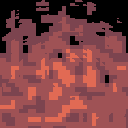
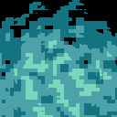
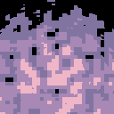
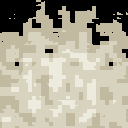

# PixelFire

English | [Русский](README-RU.md)

A HLSL shader implementation for creating a pixelated fire effect with optional text outline support.

## Examples

<div style="display: flex; justify-content: space-between; margin-bottom: 20px;">
  
  
  
  
  
</div>

## Description

PixelFire is a HLSL shader for Windows Terminal that creates a procedurally generated fire effect.

## Customization Parameters

### Fire Size and Position

```hlsl
float2 fireSize = float2(128, 128);  // Fire size in pixels
float2 firePosition = float2(
    Resolution.x - fireSize.x / 2,   // X coordinate (right)
    Resolution.y - fireSize.y / 2    // Y coordinate (bottom)
);
```

### Fire Colors

```hlsl
// Colors in RGB format (0-255)
float3 topColorRGB = float3(124, 68, 79);      // Top layer of fire
float3 middleColorRGB = float3(159, 82, 85);   // Middle layer of fire
float3 bottomColorRGB = float3(225, 106, 84);  // Bottom layer of fire
```

## Pixelation

```hlsl
float pixelDivisions = 30;     // Number of pixel grid divisions (higher = smaller pixels)
```

> 💡 **About pixel grid**: The `pixelDivisions` parameter determines the effect's detail level. Small values (1-5) create large pixels, values around 30 give a classic pixelated look, and higher values (50+) make the effect smoother.

## Text Outline Settings

```hlsl
int t = 1;  // thickness (use only 0, 1 or 2)
```

0 - no outline, 1 - thin outline, 2 - thick outline (not recommended)

## Additional Parameters

> ⚠️ **Important**: These parameters should be handled with care as they can significantly alter or break the fire effect.

```hlsl
float gradientInfluence = 0.25;   // Gradient noise influence
float voronoiInfluence = 0.75;    // Voronoi noise influence
```

### Movement Direction

```hlsl
float2 gradientMovementDir = float2(-0.1, 0.65);  // Gradient noise movement direction
float2 voronoiMovementDir = float2(0.1, 0.3);     // Voronoi noise movement direction
```

These parameters control how strongly and in which direction the fire moves.

## Installation in Windows Terminal

1. Open Windows Terminal Settings
2. Find and open `settings.json`
3. Add to the `profiles.defaults` section or to a specific profile:

```json
"experimental.pixelShaderPath": "path_to_file/PixelFire.hlsl"
```

4. Save settings.json and restart Windows Terminal

Example of a complete profile configuration:

```json
{
    "closeOnExit": "automatic",
    "colorScheme": "One Half Dark",
    "commandline": "%SystemRoot%\\System32\\cmd.exe",
    "experimental.pixelShaderPath": "D:\\PixelFire\\PixelFire.hlsl",
    "guid": "{fe031872-527f-49d0-bafd-82904a6fb3b3}",
    "hidden": false,
    "historySize": 9001,
    "name": "Shaders",
    "snapOnInput": true,
    "startingDirectory": "%USERPROFILE%",
    "tabTitle": "cmd"
}
```

**Note**: Make sure to use the full path to the shader file and forward slashes (/) instead of backslashes (\\). If you use backslashes, escape them (\\\\).

After changing parameters, save the file and open a new Windows Terminal window to test the changes.

You can also experiment with fade masks:

```hlsl
float verticalFade = smoothstep(0, 0.75, localUV.y);     // Vertical fade
float radialFade = 1.0 - length(localUV - float2(0.5, 0.5));  // Radial fade
float combinedMask = verticalFade / 1.5 + radialFade * radialFade;  // Combined mask
```

These parameters affect the shape and transparency of the fire.
